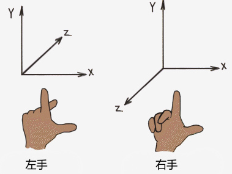

# Introduction To 3D Game Programming with DirectX12 笔记

> 书中 frame,frame of reference,space,coordinate system 都是指坐标系

## 1.向量代数
Direct3D 使用的是左手坐标系，OpenGL 使用右手坐标系。如图：

向量基本操作，令 $u=(u_{x}, u_{y}, u_{z}), v=(v_{x}, v_{y}, v_{z})$
- 如果 **u = v**, 则 $u_{x}=v_{x}, u_{y}=v_{y}, v_{z}=v_{z}$

<script type="text/javascript" src="http://cdn.mathjax.org/mathjax/latest/MathJax.js?config=default" />
