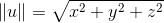

# Introduction To 3D Game Programming with DirectX12 笔记

> 书中 frame,frame of reference,space,coordinate system 都是指坐标系

## 1.向量代数(Vector Algebra)
Direct3D 使用的是左手坐标系，OpenGL 使用右手坐标系。如图：  


向量基本操作，令
- 如果 **u = v**, 则
- 
- 
- 
 
长度与单位向量（Length And Unit Vectors）
- 令,长度公式：
- 单位向量 
- 单位向量长度 

---
点乘(点积 The Dot Product)，令,  
点乘公式1.3(代数定义)：  
  
点乘的几何意义(几何定义)：一个向量在另外一个向量上的投影。有公式1.4：
  
并且该公式表现出以下性质：
- 如果，则 ，即 u 和 v 正交(orthogonal)
- 如果，则两个向量之间夹角小于90度(锐角)。
- 如果，则两个向量之间夹角大于90度(钝角)。  
*几何定义与代数定义互推见 [wiki](https://zh.wikipedia.org/wiki/%E7%82%B9%E7%A7%AF)*

---
正交(Orthogonalization)  
有两个向量 v 和 n，则 v 在 n 上的正交[投影](https://zh.wikipedia.org/wiki/%E6%8A%95%E5%BD%B1)公式如下：  


[Gram-Schmidt正交化](https://zh.wikipedia.org/wiki/%E6%A0%BC%E6%8B%89%E5%A7%86-%E6%96%BD%E5%AF%86%E7%89%B9%E6%AD%A3%E4%BA%A4%E5%8C%96)  
对于向量集 处理过程如下：  
令   
当 ，令   
规范化，

---
叉乘(叉积 The Cross Product)，它与点乘不同，点乘的计算结果是一个标量，而叉乘的计算结果是一个向量；另外，叉乘只能用于3D向量（2D向量没有叉乘）。  
令 ，叉乘公式1.5：  
  
叉乘有如下性质：
- 叉乘不满足交换律，，实际上 
- w 正交于 u,并且 w 正交于 v，即

2D伪叉乘(Psudo 2D Cross Product)，即求出一个2D向量  的垂直向量 v。针对这个问题， 就满足条件了，此时。  

使用叉乘进行正交化如图1.15:  
- 1. 令
- 2. 令
- 3. 令。由后面的练习14可知，因为w2⊥w0且||w2||=||w0||=1，所以||w2×w0||=1，这样我们就无需进行规范化操作了。

  

点(Points) ，由于使用向量可以很方便地表示相对于坐标系的点，所以我们不必为单独设计一套针对于点的运算，只需要借助于前面讨论过的向量代数框架就可以处理它们。

---
### DirectX 数学向量
DirectX 数学库，使用了[SSE2(Streaming SIMD Extensions 2)](https://en.wikipedia.org/wiki/SSE2)指令集。通过 128-bits 宽的[SIMD(single instruction multiple data)](https://en.wikipedia.org/wiki/SIMD)寄存器，能做到一个指令操作 4 个 32-bits 大小的float或int数据。

#### 向量类型
XMVECTOR，是DirectX Math 的核心向量类型，支持SIMD。XMFLOAT2(2D)、XMFLOAT3(3D)、XMFLOAT4(4D)类型，不支持 SIMD。
因此，推荐按如下情况使用：
- 1. 本地或全局变量，使用 XMVECTOR
- 2. class 成员，使用 XMFLOATn
- 3. 做数学计算前，使用加载函数（loading functions）将 XMFLOATn 转换成 XMVECTOR
- 4. 永远使用 XMVECTOR 做数学计算
- 5. 使用存储函数（storage functions）将 XMVECTOR 转换成 XMFLOATn

#### 加载和存储方法  
XMFLOATn -> XMVECTOR, 加载方法
```cpp
// Loads XMFLOAT2 into XMVECTOR
XMVECTOR XM_CALLCONV XMLoadFloat2(const XMFLOAT2 *pSource);

// Loads XMFLOAT3 into XMVECTOR
XMVECTOR XM_CALLCONV XMLoadFloat3(const XMFLOAT3 *pSource);

// Loads XMFLOAT4 into XMVECTOR
XMVECTOR XM_CALLCONV XMLoadFloat4(const XMFLOAT4 *pSource);
```
XMVECTOR -> XMFLOATn，存储方法
```cpp
// Loads XMVECTOR into XMFLOAT2
void XM_CALLCONV XMStoreFloat2(XMFLOAT2 *pDestination, FXMVECTOR V);

// Loads XMVECTOR into XMFLOAT3
void XM_CALLCONV XMStoreFloat3(XMFLOAT3 *pDestination, FXMVECTOR V);

// Loads XMVECTOR into XMFLOAT4
void XM_CALLCONV XMStoreFloat4(XMFLOAT4 *pDestination, FXMVECTOR V);
```
有时我们只想 get 或 set 某一个维度的值，可以使用下面方法：
```cpp
float XM_CALLCONV XMVectorGetX(FXMVECTOR V);
float XM_CALLCONV XMVectorGetY(FXMVECTOR V);
float XM_CALLCONV XMVectorGetZ(FXMVECTOR V);
float XM_CALLCONV XMVectorGetW(FXMVECTOR V);

XMVECTOR XM_CALLCONV XMVectorSetX(FXMVECTOR V, float x);
XMVECTOR XM_CALLCONV XMVectorSetY(FXMVECTOR V, float y);
XMVECTOR XM_CALLCONV XMVectorSetZ(FXMVECTOR V, float z);
XMVECTOR XM_CALLCONV XMVectorSetW(FXMVECTOR V, float w);
```
#### 参数传递
为了效率，XMVECTOR的值可以使用 SSE/SSE2 寄存器代替栈，将参数传递给方法。但是这种高效的方式所支持的参数数量取决于平台和编译器。所以为了保证平台无关性，我们需要使用 FXMVECTOR、GXMVECTOR、HXMVECTOR、CXMVECTOR 来传递 XMVECTOR 参数。这些类型能被平台和编译器替换成相应的类型。并且方法上需要写上 XM_CALLCONV，供不同版本的编译器使用不同的[调用约定(calling convention)](https://msdn.microsoft.com/en-us/library/windows/desktop/ee418728(v=vs.85).aspx)。

XMVECTOR 的参数传递的规则如下：
- 1. 前 3 个 XMVECTOR 参数使用 FXMVECTOR;
- 2. 第 4 个 XMVECTOR 参数使用 GXMEVECTOR;
- 3. 第 5，第 6 个 XMVECTOR 参数使用 HXMVECTOR;
- 4. 剩下的 XMVECTOR 参数使用 CXMVECTOR.

例：
```cpp
inline XMMATRIX XM_CALLCONV XMMatrixTransformation(
    FXMVECTOR ScalingOrigin,
    FXMVECTOR ScalingOrientationQuaternion,
    FXMVECTOR Scaling,
    GXMVECTOR RotationOrigin,
    HXMVECTOR RotationQuaternion,
    HXMVECTOR Translation);

inline XMMATRIX XM_CALLCONV XMMatrixTransformation2D(
    FXMVECTOR ScalingOrigin,
    float     ScalingOrientation,
    FXMVECTOR Scaling,
    FXMVECTOR RotationOrigin,
    float     Rotation,
    GXMVECTOR Translation);
```
上述规则仅只在“入参”(input parameters)时才会使用到 SSE/SSE2 寄存器，“出参”(output parameters，像 XMVECTOR& 或 XMVECTOR*，会将参数值转递给调用者)并不会有这样的特性。

#### 常向量(Constant Vectors)
作为常量的 XMVECTOR 实例，应使用 XMVECTORF32 类型。例：
```cpp
static const XMVECTORF32 g_vHalfVector = { 0.5f, 0.5f, 0.5f, 0.5f };
static const XMVECTORF32 g_vZero       = { 0.0f, 0.0f, 0.0f, 0.0f };
XMVECTORF32 vRightTop = {
    vViewFrust.RightSlope,
    vViewFrust.TopSlope,
    1.0f,1.0f
};
XMVECTORF32 vLeftBottom = {
    vViewFrust.LeftSlope,
    vViewFrust.BottomSlope,
    1.0f,1.0f
};
```
基本上，我们只要想使用初始化语法就可以使用XMVECTORF32。XMVECTORF32 是一个16-bits参数对齐(aligned)的结构(structure)。  
我们也可以使用 XMVECTORU32 来构造整数型的 XMVECTOR:
```cpp
static const XMVECTORU32 vGrabY = {
    0x00000000,0xFFFFFFFF,0x00000000,0x00000000
};
```

#### 重载操作符(Overloaded Operators)
XMVECTOR 可以使用加减乘除操作符，定义如下：
```cpp
XMVECTOR  XM_CALLCONV operator+ (FXMVECTOR V);
XMVECTOR  XM_CALLCONV operator- (FXMVECTOR V);
XMVECTOR& XM_CALLCONV operator+= (XMVECTOR& V1, FXMVECTOR V2);
XMVECTOR& XM_CALLCONV operator-= (XMVECTOR& V1, FXMVECTOR V2);
XMVECTOR& XM_CALLCONV operator*= (XMVECTOR& V1, FXMVECTOR V2);
XMVECTOR& XM_CALLCONV operator/= (XMVECTOR& V1, FXMVECTOR V2);
XMVECTOR& operator*= (XMVECTOR& V, float S);
XMVECTOR& operator/= (XMVECTOR& V, float S);
XMVECTOR XM_CALLCONV operator+ (FXMVECTOR V1, FXMVECTOR V2);
XMVECTOR XM_CALLCONV operator- (FXMVECTOR V1, FXMVECTOR V2);
XMVECTOR XM_CALLCONV operator* (FXMVECTOR V1, FXMVECTOR V2);
XMVECTOR XM_CALLCONV operator/ (FXMVECTOR V1, FXMVECTOR V2);
XMVECTOR XM_CALLCONV operator* (FXMVECTOR V, float S);
XMVECTOR XM_CALLCONV operator* (float S, FXMVECTOR V);
XMVECTOR XM_CALLCONV operator/ (FXMVECTOR V, float S);
```

#### 杂项
DirectX Math 库还定义了一些有关 π 的常量:
```cpp
const float XM_PI      = 3.141592654f;
const float XM_2PI     = 6.283185307f;
const float XM_1DIVPI  = 0.318309886f;
const float XM_1DIV2PI = 0.159154943f;
const float XM_PIDIV2  = 1.570796327f;
const float XM_PIDIV4  = 0.785398163f;
```
另外定义了长度和角度的内联函数:
```cpp
inline float XMConvertToRadians(float fDegrees)
{ return fDegrees * (XM_PI / 180.0f); }
inline float XMConvertToDegrees(float fRadians)
{ return fRadians * (180.0f / XM_PI); }
```
还有 min/max 函数:
```cpp
template<class T> inline T XMMin(T a, T b) 
{ return (a < b) ? a : b; }
template<class T> inline T XMMax(T a, T b) 
{ return (a > b) ? a : b; }
```

#### Setter 函数
```cpp
// Returns the zero vector 0
XMVECTOR XM_CALLCONV XMVectorZero();
// Returns the vector (1, 1, 1, 1)
XMVECTOR XM_CALLCONV XMVectorSplatOne();
// Returns the vector (x, y, z, w)
XMVECTOR XM_CALLCONV XMVectorSet(float x, float y, float z, float w);
// Returns the vector (s, s, s, s)
XMVECTOR XM_CALLCONV XMVectorReplicate(float Value);
// Returns the vector (v x, v x, v x, v x )
XMVECTOR XM_CALLCONV XMVectorSplatX(FXMVECTOR V);
// Returns the vector (v y, v y, v y, v y )
XMVECTOR XM_CALLCONV XMVectorSplatY(FXMVECTOR V);
// Returns the vector (v z, v z, v z, v z )
XMVECTOR XM_CALLCONV XMVectorSplatZ(FXMVECTOR V);
```

#### 向量函数
```cpp
// Returns ||v||
XMVECTOR XM_CALLCONV XMVector3Length(FXMVECTOR V); // Input v
// Returns ||v||^2
XMVECTOR XM_CALLCONV XMVector3LengthSq(FXMVECTOR V); // Input v
 // Returns v1·v2
XMVECTOR XM_CALLCONV XMVector3Dot(
    FXMVECTOR V1,  // Input v1
    FXMVECTOR V2); // Input v2
// Returns v1×v2
XMVECTOR XM_CALLCONV XMVector3Cross( 
    FXMVECTOR V1,  // Input v1
    FXMVECTOR V2); // Input v2
// Returns v/||v||
XMVECTOR XM_CALLCONV XMVector3Normalize(FXMVECTOR V); // Input v
// Returns a vector orthogonal to v
XMVECTOR XM_CALLCONV XMVector3Orthogonal(FXMVECTOR V); // Input v
// Returns the angle between v 1 and v 2
XMVECTOR XM_CALLCONV XMVector3AngleBetweenVectors( 
    FXMVECTOR V1,  // Input v1
    FXMVECTOR V2); // Input v2
void XM_CALLCONV XMVector3ComponentsFromNormal(
    XMVECTOR* pParallel,      // Returns projn (v)
    XMVECTOR* pPerpendicular, // Returns perpn (v)
    FXMVECTOR V,       // Input v
    FXMVECTOR Normal); // Input n
// Returns v1=v2
bool XM_CALLCONV XMVector3Equal(
    FXMVECTOR V1,  // Input v1
    FXMVECTOR V2); // Input v2
// Returns v 1 ≠ v 2
bool XM_CALLCONV XMVector3NotEqual(
    FXMVECTOR V1,  // Input v1
    FXMVECTOR V2); // Input v2
```
#### Floating-Point 错误
浮点数在计算机系统中都是近似表达，因此针对任意实数 p，1的p次方=1，该等式在计算机系统中不成立。  
为了避免这种不精确的情况，我们定义了一个 epsilon 变量作为误差值，当两个值相差小于 epsilon，则就将这两个值视作相等（即近似相等）。函数定义如下：
```cpp
const float Epsilon = 0.001f;
bool Equals(float lhs, float rhs)
{
    // Is the distance between lhs and rhs less than EPSILON?
    return fabs(lhs - rhs) < Epsilon ? true : false;
}
```
DirectX Math 库中已有类似的函数 XMVector3NearEqual:
```cpp
// Returns
// abs(U.x – V.x) <= Epsilon.x &&
// abs(U.y – V.y) <= Epsilon.y &&
// abs(U.z – V.z) <= Epsilon.z
XMFINLINE bool XM_CALLCONV XMVector3NearEqual(
    FXMVECTOR U,
    FXMVECTOR V,
    FXMVECTOR Epsilon);
```

## 2 矩阵代数
### 矩阵定义
一个m×n的矩阵是一个由m行（row）n列（column）元素排列成的矩形阵列。
- 两个矩阵相等，当且仅当他们之间对应的元素相等。
- 两个矩阵的加法，是两个矩阵对应元素相加，其结果是一个新的矩阵
- 矩阵乘以一个系数，只需将该矩阵的各个元素乘以一个系数即可
- 两个矩阵相减，就是两个矩阵各个元素之间相减。本质上是一个矩阵减去乘以-1的矩阵

矩阵满足以下性质：
- A + B = B + A 加法交换律
- (A + B) + C = A + (B + C) 加法结合律
- r(A + B) = rA + rB 标量乘法分配律(系数分配给矩阵)
- (r + s)A = rA + sA 标量乘法分配律(矩阵分配给系数)

### 矩阵相乘
矩阵相乘，就是A矩阵的行向量与B矩阵的列向量点乘，公式如下：  
  

### 向量与矩阵相乘
向量与矩阵相乘，即向量与矩阵的列向量点乘：  
![\begin{aligned}
uA&=\left [ x, y, z \right ]\begin{bmatrix}A_{11}& A_{12} & A_{13} \\ A_{21} & A_{22}& A_{22} \\ A_{31}&A_{32} & A_{33} \end{bmatrix}\\
&=\begin{bmatrix} u \cdot A_{*,1} & u \cdot A_{*,2} & u \cdot A_{*,3} \end{bmatrix} \\
&=\begin{bmatrix} xA_{11}+yA_{21}+zA_{31} & xA_{12}+yA_{22}+zA_{32} & xA_{13}+yA_{23}+zA_{33} \end{bmatrix} \\
&=\begin{bmatrix} xA_{11},xA_{12},xA_{13} \end{bmatrix} + \begin{bmatrix} yA_{21},yA_{22},yA_{23} \end{bmatrix}+
\begin{bmatrix} zA_{31},zA_{32},zA_{33} \end{bmatrix}\\
&=x\begin{bmatrix} A_{11},A_{12},A_{13}\end{bmatrix} +y\begin{bmatrix}A_{21},A_{22},A_{23} \end{bmatrix}+z\begin{bmatrix} A_{31},A_{32},A_{33} \end{bmatrix}\\
&=xA_{1,*}+yA_{2,*}+zA_{3,*}
\end{aligned}](img/3d-directx12-latex-1d35.png)
因此，得公式:  


将上述公式推广到 n 维，可得:  


矩阵相乘也满足一些性质：
- A(B + C) = AB + AC, (A + B)C = AC + BC, 乘法分配律
- (AB)C = A(BC), 乘法结合律

### 转置矩阵


性质：
- 
- 
- 
- 
- 

### 单位矩阵
对角线元素为1，其余元素为0的正方形矩阵叫单位矩阵。如果 A 是 m x n 的矩阵，B 为 n x p 的矩阵，I 为 n x n 的单位矩阵，则 AI = A，并且 IB = B。  
如果 M 是方阵，则 M 与单位矩阵的乘法运算满足交换律，MI = IM = M。

### 矩阵的行列式
[行列式（Determinant）](https://zh.wikipedia.org/wiki/%E8%A1%8C%E5%88%97%E5%BC%8F)是数学中的一个函数，将一个 n x n 的矩阵 A 映射到一个标量，记作 det(A)或 |A|。

#### [余子式](https://zh.wikipedia.org/wiki/%E5%AD%90%E5%BC%8F%E5%92%8C%E4%BD%99%E5%AD%90%E5%BC%8F)
在线性代数中，一个矩阵A的余子式（又称余因式）是指将A的某些行与列去掉之后所余下的方阵的行列式。相应的方阵有时被称为余子阵。  
给定一个n×n矩阵A，其余子阵 ，是指删除了第i行和第j列后的(n − 1)×(n − 1)矩阵。

#### [伴随矩阵](https://zh.wikipedia.org/wiki/%E4%BC%B4%E9%9A%8F%E7%9F%A9%E9%98%B5)
设 A 是一个 n x n 矩阵，则 称为元素的代数余子式。如果我们计算并用它替换 A 中的第ij位置的每个元素，我们就可以获得 A 的余子矩阵。(注：余子矩阵和余子式中的余子阵是两个概念):  
  
如果我们对 进行转置，则所得的矩阵就是 A 的伴随矩阵，由如下公式表示：  


### [逆矩阵](https://zh.wikipedia.org/wiki/%E9%80%86%E7%9F%A9%E9%98%B5)
矩阵代数没定义除法运算，但是它定义了一种乘法的逆（inverse）运算。下面的列表总结了有关逆运算的要点：
- 1．只有正方形矩阵能做逆运算；所以，当我们说求逆矩阵时是假设我们正在处理的是一个正方形矩阵。
- 2．一个n×n矩阵M的逆矩阵仍然是一个n×n矩阵，记作。
- 3．不是所有的正方形矩阵都有逆矩阵。有逆矩阵的正方形矩阵称为可逆（invertible）矩阵，没有逆矩阵的称为单调（singular）矩阵。
- 4．如果存在逆矩阵，则该逆矩阵是唯一的。
- 5．将一个矩阵与它的逆矩阵相乘，其结果必定为单位矩阵：。注意，矩阵与它的逆矩阵的相乘次序可以互换，这是矩阵乘法中的一个特例。

逆矩阵在求解矩阵方程时非常有用。例如，我们给出矩阵方程pʹ=pM，已知pʹ和M的值，求解p。假设M是可逆矩阵（即，存在），那么我们可以按照如下步骤求解：
| |
--------------------------------------------|----
|等式两边同时乘以
|由逆矩阵的定义可知
|由单位矩阵的定义可知

下面的这个方程可以用来求逆矩阵:  


与逆矩阵相乘时非常有用的代数特性：  

这个特性假设A和B都是可逆的，它们都是维数相同的正方形矩阵。要证明是AB的逆矩阵，我们只需要证明和。推导过程如下：
  


### DirectX 数学矩阵（略）

## 矩阵变换
我们以几何方式描述3D场景中的物体；也就是用一组三角形近似地模拟物体的外表面。如果我们创建的物体都静止不动，那么场景就会显得索然无趣。所以，我们必须学习对几何体进行变换的方法；常见的几何变换包括平移、旋转和缩放。我们可以使用些公式对3D空间中的点和向量进行变换。
### 线性变换
考虑一个数学函数τ(v)= τ(x,y,z) = (xʹ,yʹ,zʹ)。这个函数的输入和输出都是一个3D向量。当且仅当τ满足以下性质时我们才认为它是一个线性变换：  
  
其中 和为任意3D向量，k是一个标量。  
(注：线性变换的输入和输出不一定是3D向量，但在3D图形学的书中我们无需使用其他更普遍的形式。)

如果τ是线性的，它应该满足下面的式子(公式3.2)：  


#### 矩阵表述
令 u=(x, y, z)，我们总能用一下形式表示：  
  
向量 **i**=(1, 0, 0)，**j**=(0, 1, 0)和 **k**=(0, 0, 1)都是沿着坐标轴的单位向量，我们把它们称为的标准基向量（standard basis vectors）（表示所有3D坐标向量(x , y , z)的集合）。令τ为线性变换，则根据线性函数的特点(即公式3.2)，我们可以得到(公式3.3)：  


公式3.3其实就是一个线性组合，我们在上一章就已经讨论过了，这个线性组合可以根据公式2.2写成矢量与矩阵的乘法，因此我们可以将公式3.3重写成如下形式：  
![\begin{aligned}
\tau(u)&=x\tau(\mathbf{i})+y\tau(\mathbf{j})+z\tau(\mathbf{k}) \\
&=uA \\
&=[x,y,z]\begin{bmatrix}\leftarrow & \tau(\mathbf{i}) & \rightarrow \\ \leftarrow & \tau(\mathbf{j}) & \rightarrow \\ \leftarrow & \tau(\mathbf{k}) & \rightarrow \end{bmatrix}\\
&=[x,y,z]\begin{bmatrix} A_{11} & A_{12} & A_{13} \\ A_{21} & A_{22} & A_{23} \\ A_{31} & A_{32} & A_{33} \end{bmatrix}
\end{aligned}](img/3d-directx12-latex-1d70.png)  
其中，，。我们把矩阵A称为线性变换τ的矩阵描述。

#### 仿射变换

## Direct3D 初始化
### 准备

##### 纹理格式(Textures Formats)
一个 2D 纹理就是一个包含数据元素的矩阵。2D 纹理的一个用途就是存储一个2D图像数据，它的每个元素就是像素的颜色。然而这并不是唯一的用途；举个例子，一个高级技术叫做标准映射，每个纹理元素存储了一个3D向量而不是像素的颜色。所以，虽然我们一般会认为纹理存储的是图像数据，然而它所能做的更多。一个1D纹理就像一个1D数组，一个2D纹理就像一个2D数组，一个3D纹理就像一个3D数组。下面几章将会描述，纹理并不仅仅是一个数组；它们还有纹理贴图等级，并且GPU能对它们做特殊处理，像滤镜或采样。另外，纹理并不能存储任意类型的数据；它只能存储DXGI_FORMAT数据，如：
- DXGI_FORMAT_R32G32B32_FLOAT:表示每个元素都是三个 32-bit的浮点型组件
- DXGI_FORMAT_R16G16B16A16_UNORM:每个元素都是四个 16-bit 的组件，取值范围在[0,1]
- DXGI_FORMAT_R32G32_UINT: 每个元素都是两个32-bit无符号整型组件
- DXGI_FORMAT_R8G8B8A8_UNORM: 每个元素都是四个 8-bit 无符号组件，取值范围在[0,1]
- DXGI_FORMAT_R8G8B8A8_SNORM: 每个元素都是四个 8-bit 有符号组件，取值范围在[-1, 1]
- DXGI_FORMAT_R8G8B8A8_SINT: 每个元素都是四个 8-bit 有符号整型组件，取值范围在[-128,127]
- DXGI_FORMAT_R8G8B8A8_UINT: 每个元素都是四个 8-bit 无符号整型组件，取值范围在[0, 255]
- DXGI_FORMAT_R16G16B16A16_TYPELESS: 每个元素都是四个 16-bit 的组件，可以在后面处理过程中，重新解释为其他类型
注：R、G、B、A分别表示red, green, blue, alpha

##### 交换链与翻页(The Swap Chain and Page Flipping)
front buffer用来存储当前显示在显示器上的图像数据，这时下一帧的动画在 back buffer 中绘制。当这一帧动画在 back buffer 中绘制完成后，back buffer 和 front buffer 角色互换：之前的 back buffer 现在变成了 front buffer，之前的 front buffer 现在变为 back buffer用于下一帧动画绘制。交换 back front buffer 角色这一过程叫做呈现(Presenting)。呈现(Presenting)是一个高效的操作，仅仅是将指向 front buffer 的指针和指向 back buffer 的指针互换。

##### 深度缓冲(Depth buffering)
深度缓冲区(Depth buffer)是不含图像数据纹理的一个例子，它存储的是特定像素的深度信息。深度取值范围是[0.0, 1.0]，其中 0.0 代表对观察者来说视锥中最近的物体，1.0代表对观察者来说视锥中最远的物体。back buffer 中的像素与 depth buffer 中的元素一一对应（即 back buffer 中第ij个元素对应于 depth buffer 中的第ij个元素）。因此，back buffer 分辨率为 1280 x 1024 时，会有深度项(depth entries，深度元素)。

深度缓冲区使用的数据格式:
- DXGI_FORMAT_D32_FLOAT_S8X24_UINT: 32-bit浮点型深度缓冲区,保留 8-bits无符号整型作为模版缓冲，取值在 [0,255]，并且 24-bits不使用，为了做填充
- DXGI_FORMAT_D32_FLOAT: 32-bit浮点型深度缓冲区
- DXGI_FORMAT_D24_UNORM_S8_UINT: 24-bit 无符号类型深度缓冲区，取值[0,1]；8-bits 保留作为模版缓冲，取值[0,255]
- DXGI_FORMAT_D16_UNORM: 16-bit 无符号类型缓冲区，取值[0,1]

##### 资源与描述符(Resources and Descriptors)
在渲染阶段，GPU会写入资源文件（back buffer，depth/stencil buffer），读取资源文件(描述界面的纹理，场景中3D几何坐标的缓冲数据)。在发起一个绘制指令之前，我们需要先绑定资源到渲染管道中，这样绘制过程中才能引用这些资源文件。有些资源文件在绘制过程中会改变，所以如果有必要，我们需要在每次绘制时更新这些绑定。

然而，GPU资源文件并不是直接绑定的。相反，一个资源文件是通过描述符对象(descriptor object)来被引用的，描述符对象可以被视作是一个轻量的针对GPU描述资源文件的结构。重要的是这是一个间接层；给一个资源文件的描述符，GPU能获得具体的资源数据并且知道该资源文件的必要信息。我们通过确定这些描述符来将资源文件绑定到渲染管道中，供绘制时引用。

描述符类型：
- CBV/SRV/UAV 描述符，描述了常量缓冲区(constant buffers)，着色器资源(shader resources)和无序访问视图资源(unordered access view resources)。
- 样本描述符，描述了样本资源(sampler resources)，用于纹理。
- RTV 描述符，描述了渲染目标资源(render target resources)。
- DSV 描述符，描述了深度/模版资源(depth/stencil resources)

##### 多重采样理论(Multisampling Theory)
当提高屏幕分辨率不能解决锯齿问题时，我们需要一些反锯齿技术来处理。
- 超采样：back buffer 和 depth buffer 4倍于屏幕分辨率。3D场景会在 back buffer 中以大分辨率形式渲染。然后当它要呈现到屏幕中时，这个 back buffer 会将 4 个像素块颜色以平均色展现。该方法在软件中提高分辨率很有效。但是这种方法很消耗资源，因为它增加了大量的像素处理以及内存
- 多采样：比超采样消耗资源少得多，因为它共享子像素之间的计算信息.假设我们使用4倍的多采样（即一个像素当四个子像素处理），多采样和超采样一样也使用4倍于屏幕分辨率的 back buffer 和 depth buffer；然而和超采样不一样的是它只在像素中心计算一次，并根据可见性与其子像素共享该颜色信息，进行填充(可见性由 depth/stencil test 决定，并且每个子像素计算一次)。

注：像素的颜色计算在 graphics pipeline 中是一个昂贵的操作。

### CPU/GPU 相互作用
#### 命令队列和命令列表(The Command Queue and Command Lists)

#### CPU/GPU 同步

#### 资源过渡(Resource Transitions)

### 初始化 Direct3D

### 定时与动画