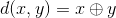

# Kademlia: 一个基于XOR度量标准的 P2P 信息系统 (翻译)

作者： Petar Maymounkov and David Mazi` eres，New York University，{petar,dm}@cs.nyu.edu，http://kademlia.scs.cs.nyu.edu

翻译来源：https://blog.csdn.net/hoping/article/details/5307320

## 摘要

我们描述了一个P2P分布式哈希表，它在容易出错的环境中具有可靠的一致性和性能。 我们的系统使用基于XOR的新型元拓扑来路由查询和定位节点，从而简化算法并简化我们的证明。 拓扑结构具有以下特性：每个交换的消息都传达或重新提供有用的联系信息。 系统利用此信息发送并行的异步查询消息，这些消息可以容忍节点故障，而不会对用户造成超时延迟。

## 1.介绍

本文描述了 Kademlia，一种点对点分布式哈希表（DHT）。 Kademlia 具有许多以前DHT不能同时提供的理想功能。 它最大限度地减少了节点必须发送以便相互了解的配置消息的数量。配置信息会自动传播，作为密钥查找的副作用(非贬义，这里是附带作用的意思)。 节点具有足够的智能和灵活性，可通过低延迟路径路由查询。Kademlia 使用并行异步查询来避免失败节点的超时延迟。 节点记录彼此存在的算法用来抵抗某些基本的拒绝服务攻击（即DoS攻击）。 最后，Kademlia的几个重要属性可以仅使用对正常运行时间分布的弱假设进行形式验证（我们通过对现有P2P系统的测量进行验证的假设）。

Kademlia采用了许多DHT的基本方法。key 是不透明的，160-bit 大小（例如，某些较大数据的SHA-1散列）。每个参与计算的机器在160-bit key  space 中都有一个 node ID。根据某种对“接近”的定义，<key, value> 被存储在 ID 和 key “接近”的 node 之上。最后，基于node ID 的路由算法允许任何人有效地定位任何给定目标 key 附近的服务器。

在 Kademlia 中， key 空间中的点之间的距离是基于 XOR 度量进行的，这种新颖的方法为其带来了诸多好处。XOR 是对称的，因此 Kademlia 节点所接收到的 lookup 查询请求的发送者就具有和其路由表中的节点完全一样的分布。不具有这个特性的系统（比如： [Chord][5] ）无法从其所收到的查询请求中学习有用的路由信息。更糟糕的是，缺乏这种对称性会导致呆板的路由表。在 Chord 中，节点 finger 表中的每个条目中所存储的节点，必须恰好是 ID 空间中的某个区间的前驱。实际存在于该区间中的任何一个节点和该区间中的前驱节点之间的距离可能相距甚远。而 Kademlia 则可以向一个区间中的任何节点发送查询请求，这样就可以根据响应时间选择路由，甚至可以向多个合适的节点发送并行、异步的查询请求。

在找出那些和某个特定 ID 接近的节点的过程中， Kademlia 仅使用了唯一的一个路由算法。其他的系统则不是这样，它们先使用一个算法来接近目标 ID ，然后在最后几步定位中则采用了另外一个算法。在当前的系统中，[Pastry][1]中的第一阶段算法与 Kademlia 最为相似，也是采用 Kademlia 的 XOR 度量方法连续查找，以大至折半的速度逼近目标 ID （其作者并没有这样去描述）。但是，在其第二阶段中， Pastry 改变的距离度量方法，转为使用 IDs 间的数值差。在数据复制时，Pastry 同样采用了另外一种数值差度量方法。遗憾的是，在第 2 种度量方法中距离接近的节点用第一种方法来度量可能相距甚远，从而导致针对某个特定节点 ID 的不连续性，造成性能下降，并且难以对其最差情况进行规范化分析。

## 2.系统描述

总的来说，我们采用了和其他 DHTs 中完全一样的方法：节点的 ID 是 160-bit 不透明的值，我们的算法也是逐步“逼近”所期望的 ID ，并以对数级的速度收敛到要查询的目标。

Kademlia 把节点看做是一棵二叉树的叶子，其中每个节点的位置由其 ID 的最短唯一前缀决定。图1 展示了一棵示例树中唯一前缀为 0011 的节点的位置。对于任何一个给定节点，我们都把树划分成一系列不包含该节点的逐步降低的子树。最高层的子树由二叉树中不含该节点的那一半组成。接下来的子树由剩下的树中不包含该节点的子树组成，以此类推。对于示例图中的节点 0011 ，子树被圆圈标识出来，分别由所有前缀为 1 ， 01 ， 000 以及 0010 的节点组成。

> 图1：Kademlia 二叉树。黑点表示 0011... 的节点在树中的位置。灰色圈表示 0011... 节点需要通信的子树。

Kademlia 协议保证了每个节点都至少知晓这些子树中的一个节点（如果子树不为空的话）。有了这个保证，每个节点就都可以通过 ID 来定位其他任何节点。图2 展示了节点 0011 定位节点 1110 的示例，其中节点 0011 通过逐步查询它所知道的最佳节点来取得和越来越低层次子树的联系；最后查询收敛到目标节点。

> 图2：通过ID来定位一个节点。这里，具有前缀0011的节点通过连续学习和查询越来越近的节点来找到具有前缀1110的节点。 顶部的线段表示160-bit ID的空间，并显示查找如何收敛到目标节点。 下面我们将说明 1110 所做的RPC消息。第一个RPC是节点101，已知为 1110。后续RPC是前一个RPC返回的节点。

接下来，我们会补充一些细节，并更具体的描述查询算法。首先，我们会给出 ID 接近这个概念的准确定义，这样就可以谈及“在距离 key 最近的 k 个节点上存储或者查询 <key,value> 对”这样的行为。然后，我们会介绍一个查询协议，该协议即使在任何节点都不和某个 key 具有相同的前缀或者和某个给定节点关联的子树中有一些为空的情况下，都可以正常工作。

### 2.1 XOR 度量

每个 Kademlia 节点都具有一个 160-bit 的节点 ID。我们可以像 Chord 那样对节点 IDs 进行规范的组织，不过，目前它们只是随机的 160-bit 标示符。节点所发送的每个消息中都包括该节点的 ID ，这样接收者就可以在需要时记录下发送者的在线状态。

Keys 也是 160-bit 的标示符。Kademlia 根据两个标示符之间的距离来把 <key,value> 对分配给特定的节点。对于两个 160-bit 标示符 x 和 y ，Kademlia 把它们之间的距离定义为二者按位异或（ XOR ）结果的整数值，。

首先，XOR 是一种有效的度量方法（虽然不是欧几里得几何意义上的）。很显然，d(x,x)=0；当x 不等于y 时，d(x,y)>0 ，并且对于任意的 x,y 来说，d(x,y)=d(y,x) 。XOR 还具有三角特性：d(x,y)+d(y,z) 大于等于d(x,z)。该三角特性可以从如下事实得出：，并且对于任意大于等于 0 的 a 和 b：a+b 都大于等于。

同时，XOR 也刻画出了隐含在我们基于二叉树描绘的系统中距离的概念。在 160-bit ID 的满二叉树中，两个IDs 间的距离大小就是包含它们的最小子树的高度。当树不是满的时，距离ID x 最近的叶子就是其ID 和x 具有最长的公共前缀的那个叶子。如果树中有空的分支，那么具有最长公共前缀的叶子就会有多个。此时，我们基于该树的空分支，把 x 对应的位取反得到ID x’ ，那么距离 x’ 最近的叶子即为距离 x 最近的叶子。

和 Chord 中沿圆周顺时针方向的度量方法一样，XOR 也是单向的。对于任意给定的点x 和距离 Δ>0 ，仅存在一个点 y 使得d(x,y)=Δ。单向性保证了无论从哪个节点开始查询，都会沿着同样的路径进行收敛。因此，沿着查询路径对<key,value> 进行 cache 就可以避免热点问题。基于XOR 的拓扑也是对称的（对于所有的x,y: d(x,y)=d(y,x) ），这一点和Pastry 一样，在 Chord 中则不具有对称性。

### 2.2 节点状态

Kademlia 节点中保存有路由查询消息所需要的相互联系信息。对于位于 [0,160) 中的每个 i ，每个节点都保存有一个 <IP 地址,UDP 端口,节点 ID> 三元组列表，三元组中的节点 ID 为那些和其距离位于 2^i 和 2^(i+1) 之间的节点的 ID。我们称这些列表为 k-buckets 。每个 k-bucket 都按照节点最近联系时间排序——最近未联系的节点放在表头，最近联系的节点放在表尾。对于小的 i 值， k-buckets 一般都是空的（因为不存在没有合适节点）。对于大一些的 i 值，列表的长度可以扩展到 k ， k 是系统范围内定义的复制参数。k 的值按照这样的方式给出：任意 1 小时内，任意给定的 k 个节点同时失效的可能性很小（比如，k=20 ）。

当 Kademlia 节点收到任何来自其他节点的消息（请求或者回应）时，就会更新和消息发送者的节点 ID 对应的 k-bucket 。如果发送节点已经存在于接收节点的 k-bucket 中，接收节点就会把其移到列表的尾部。如果发送节点还没有出现在相应的 k-bucket 中，并且该 k-bucket 中的元素个数小于 k ，那么接收节点就把发送者放到列表的尾部。如果相应的 k-bucket 中的元素达到上限，此时，接收节点会 ping 该 k-bucekt 中最近最少联系的节点来决定该如何做。如果最近最少联系的节点没有响应，那么就把其从 k-bucket 中去除，然后把发送节点插入列表尾部。否则，如果收到了最近最少联系的节点的响应，那么就把其移到列表尾部，并丢弃掉发送者节点的联系信息。

k-buckets 有效地实现了一种最近最少联系的置换策略，只是活动的节点永远不会被从列表中去除。这种对于老联系信息的偏爱来自于我们对 Saroiu 等人[4]所收集的 Gnutella 节点跟踪数据的分析。图3 中展示了那些已经在线一段时间，还会继续在线 1 小时的 Gnutella 节点的百分比。节点已经在线的时间越长，再保持在线一小时的可能性就越高。通过保留那些最老的、活动的联系信息， k-bucekts 最大化了其所保存的节点依然在线的可能性。

> 图3 作为正常运行时间的函数，在线保持另一小时的可能性。x轴表示分钟。 y轴显示在线保持至少x分钟的节点的分数，该分数也保持在线至少x + 60分钟。

k-buckets 的另外一个好处是，其可以阻止某些 DoS 攻击。攻击者无法通过向系统中不停添加新节点的方法清空节点的路由状态。Kademlia 节点只会在老节点离开系统时才插入新的节点。

### 2.3 Kademlia 协议

Kademlia 协议有 4 个 RPCs 组成，分别为： PING，STORE，FIND_NODE 以及 FIND_VALUE。PING RPC 会对一个节点进行探测以确定其是否在线。STORE 指示一个节点存储一个 <key,value> 对，以用于以后的获取。

FIND_NODE 的参数是一个 160-bit 的 ID 。该 RPC 的接收者要返回它所知道的距离目标 ID 最近的 k 个节点的三元组 <IP 地址，UDP 端口，节点 ID> 列表。这些三元组可以来自一个 k-bucket ，也可以来自多个（最接近的那个 k-bucket 不满的话）。无论如何，该 RPC 的接收者都必须返回 k 个结果（除非所有的 k-buckets 中的个数加起来也不足 k 个，此时返回知道的所有节点）。

FIND_VALUE 和 FIND_NODE 的行为相似，也是返回三元组 <IP 地址，UDP 端口，节点 ID> 列表，不过有一个例外。如果该 RPC 的接收者曾经收到过针对该 key 的 STORE RPC ，那么它仅返回所存储的值。

对于所有的 RPCs ，接收者必须回应一个 160-bit 的随机 RPC ID ，这可以阻止一些地址欺骗行为。RPC 的接收者可以把 PING 附带在 RPC 的回应中以进一步确认发送者网络地址的有效性。

Kademlia 节点必须要做的最重要的事情是找出距离某个给定节点 ID 最近的 k 个节点。我们把这个过程叫做 node lookup (节点查询)。Kademlia 采用了一个递归算法进行节点查询。查询的发起者首先从最近的非空 k-bucket 中选出 α 个节点（如果该 bucket 中元素的个数小于 α ，那么就选出它所知道的 α 个最近的节点）。接着，发起者向选出的这 α 个节点同时发送异步的 FIND_NODE RPC 。 α 是一个系统范围内的并发参数，比如，3 。

在递归步骤中，发起者向从前面 RPC 中"学到的"节点重新发送 FIND_NODE 。（这个递归过程可以在前面发起的 α 个 RPCs 都返回前就开始）。从学到的距离目标最近的 k 个节点中，发起者从中选出 α 个还没有询问过的节点，并向它们重发 FIND_NODE RPC【可以在 bucket 元素以及 FIND 的回应中增加 round trip 时间信息，用来挑选这 α 个节点。】。没有响应的节点则立即不予考虑，直到（除非）其响应为止。如果一轮 FIND_NODES 下来没有发现更为接近的节点，发起者就向还没有查询过的 k 个最近节点重发 FIND_NODE 。当发起者询问过它所知道的最近的 k 个节点，并且得到了它们的回应时，查询过程结束。当 α=1 时，在消息开销和故障节点的检测时延方面，该算法和 Chord 的接近。不过， Kademlia 可以做到低时延路由，因为它具有选择 k 个节点中的任何一个向其发送请求的灵活性。

Kademlia 的绝大部分操作都是基于上述查询过程实现的。为了存储一个 <key,value> 对，节点先找出距离 key 最近的 k 个节点，然后向它们发送 STORE RPCs 。此外，节点在必要时都会重新发布 <key,value> 对，以保持数据可用（会在 2.5 小节中介绍）。该行为可以确保 <key,value> 对以非常高的概率持续存在于系统中（我们会在概要证明中介绍）。针对 Kademlia 的当前应用（文件共享），我们同样要求 <key,value> 的原始发布者每 24 小时就要重新发布一次。否则，在发布的 24 小时之后，<key,value> 对就会过期，这样就限制了系统中过期索引信息的数量。对其他应用来说（比如数字认证或者用于值映射的加密 hash），更长一点过期时间也许会更合适一些。

要想找到一个 <key,value> 对，节点首先要执行一个查询过程以找到距离 key 最近的 k 个节点。不过，在查找值时使用的是 FIND_VALUE RPC 而不是 FIND_NODE。此外，当任何一个节点返回了 value 时，该过程就立即结束。出于 caching 的目的，一旦查询成功，发起请求的节点会把 <key,value> 对存储在它所观察到的距离 key 最近但是没有返回 value 的节点上。

由于拓扑结构的单向性，后面再次去查找该 key 时，很可能在去查询最接近的节点之前就在 cache 中找到。对于某个特别受欢迎的 key ，系统会在许多节点上对其进行 cache 。为了避免“过度 caching ”，我们把 <key,value> 对在节点数据库中的过期时间设置成与当前节点和距离 key ID 最近的节点之间的节点个数成指数级反比关系【该数目可以从当前节点的 bucket 结构中推导出来。】。虽然简单的 LRU 置换策略也能产生出类似的生存期分布，但是我们没有好的方法来选择 cache 的大小，因为节点无法预先知道系统将会存储多少值。

一般来讲，节点之间往来的请求消息流就可以保持 buckets 最新。为了应对某些极端情况，比如：某个节点区间从来没有进行过查询请求，节点会对过去 1 小时内没有进行过节点查询的所有 kucket 进行更新操作。更新意味着从 bucket 中随机选择一个 ID ，然后执行一次针对该 ID 的节点查询。

如果一个节点 u 想要加入 Kademlia 网络，它必须要与已经存在于网络中的某个节点 w 取得联系。u 把 w 插入到相应的 k-bucket 中。接着，u 发起一次针对自己节点 ID 的查询。最后， u 更新比最近相邻节点远的所有 k-buckets 。在更新过程中， u 既填充了自己的 k-buckets ，同时也把自己加入到其他节点的 k-buckets 中。
 
### 2.4 路由表

基于 Kademlia 的协议，我们可以很容易地定义出其基本的路由表结构，只是在某些高度不平衡的树中，需要处理一些微妙的情况。路由表是一颗二叉树，其叶子是 k-buckets 。每个 k-bucket 存放着具有某些公共 ID 前缀的节点。前缀就是该 k-bucket 在二叉树中的位置。因此，每个 k-bucket 覆盖了 ID 空间的某个范围，所有 k-bucket 合起来完整覆盖了整个 160 位 ID 空间。

节点是根据需要动态分配到路由树中的。图 4 说明了这个过程。一开始，节点 u 的路由树只有一个节点——覆盖整个 ID 空间的单个 k-bucket 。当 u 学到一个新节点的联系信息时，就会试图把其插入到相应的 k-bucket 中。如果该 bucket 不满，简单将其插入即可。否则，如果该 k-bucket 的区间范围包含了 u 自己的节点 ID ，那么该 bucket 会分裂为两个新的 buckets ，原有的内容会被划分到这两个 buckets 中，接着重复插入过程。如果 k-bucket 已满且不含有 u 的节点 ID ，那么就直接丢弃这个新的联系信息。

> 图4 随着时间的推移，路由表的演变。 最初，节点具有单个k-bucket，如顶部路由表中所示。 当k-buckets填充时，其范围覆盖节点ID的桶重复分成两个k桶。

当树非常不平衡时，就会出现一个复杂情况。假设节点 u 加入了一个系统，并且是那个系统中仅有的一个 ID 以 000 为前缀的节点。进一步假设系统中 ID 以 001 为前缀的节点个数超过 k 。每个具有前缀 001 的节点都会具有一个空的、应将 u 插入其中的 k-bucket ，但是 u 在对其 bucket 进行更新时只会通知到其中的 k 个节点。为了避免这种情况发生， Kademlia 节点会在一颗多于 k 个节点的子树中保存所有有效的联系信息，即使这会要求对不含有节点自己 ID 的 buckets 进行分割。图 5 说明了这些附加的分割过程。当 u 更新这些分割过的 buckets 时，所有具有 001 前缀的节点都会得到通知。

> 该图例示了ID为00 ... 00的节点的宽松路由表。宽松表在其分支中可能具有小的（预期的恒定大小）不规则性，以确保它知道节点周围的最小子树中的所有联系人。 至少有k个联系人。

### 2.5 高效的 key 重新发布

为了保证 key-value 对在系统中的持久性，节点必须对 key 进行周期性地重新发布。否则，有两种情况会导致对有效 key 的查询失败。首先，在发布时，最初获得 key-value 对的 k 个节点中的一些会离开网络。其次，新加入节点的 ID 相比 key-value 对的原始发布节点，可能距离该 key 更近一些。在这两种情况下，拥有 key-value 对的节点必须要对其进行重新发布，这样就再次保证了从距离该 key 最近的 k 个节点上可以获取该 key 。

为了对节点离开造成的问题进行弥补， Kademlia 每一小时就对每个 key-value 对进行重新发布。该策略的一种幼稚的实现会导致很多的消息往来——存储 key-value 对的 k 个节点每小时都会先进行一次节点查询然后再进行 k-1 次 STORE RPC 调用。幸运的是，可以对这个重新发布过程进行深度的优化。首先，当节点收到针对某个 key-value 对的 STORE RPC 时，它可以认为该 RPC 也发给了其他 k-1 个最近节点，因此在下一个小时就不会重新发布该 key-value 对。这就保证了只要重新发布间隔不是精确同步的，对于任何一个 key-value 对来说，每小时只会有一个节点对其进行重新发布。

第 2 个优化可以避免在重新发布 key 之前进行节点查询。如 2.4 小节中所述，为了应对不平衡树，节点在需要时可以分裂 k-buckets 以保证其具有关于一个节点个数超过 k 的边缘子树的全部知识。在重新发布 key-value 对之前，如果节点 u 更新了该子树中 k 个节点的所有 k-buckets ，那么它将自动获取了关于距离某个 key 值最近的 k 个节点的信息。对这些 bucket 的更新代价可以分摊到许多 key 的重新发布上面。

要想知道为何在对规模大于 k 的子树中的 buckets 进行更新后，就无需再进行节点查询操作，就得考虑两种情况。如果要被重新发布的 key 位于该子树覆盖的 ID 区间内，那么由于该子树的规模至少为 k ，并且 u 具有关于该子树的全部知识，因此 u 一定知道距离该 key 最近的 k 个节点。另一方面，如果 key 位于子树范围之外，而 u 是距离该 key 最近的 k 个节点之一，那么按照 u 的 k-buckets 规则，所有距离该 key 比子树更近一些的区间中的元素都少于 k 。因此， u 将知道这些 k-buckets 中的所有节点，再加上关于子树的知识，就可以得到距离该 key 最近的 k 个节点。

当一个新节点加入系统时，对于每个 key-vaule 对来说，如果该节点为其 k 个最近节点之一，那么必须对其进行存储。系统中原有的节点同样可以通过其边缘子树的完整知识，知道哪些 key-value 对需要存储在该新增节点上。每个了解到新节点的节点都会发起 STORE RPC 把相关的 key-value 对传送到新节点之上。为了避免重复的 STORE RPC ，只有那些自身 ID 比其他节点 ID 更接近 key 的节点才会进行 key-value 对的传送。

## 3.概要证明

为了说明我们的系统是完全可用的，我们必须证明： 1 、绝大多数操作都可以在 的时间内完成（ c 是一个小常量）； 2 、一个 <key，value> 查询能够以极高的概率得到系统中的存储结果。

我们先来给出一些定义。对于一个覆盖了距离区间   的 k-bucket 来说，称 i 为该 bucket 的索引。我们把节点的深度 h 定义为 160-i ，其中 i 为其非空 k-bucket 的最小索引。节点 y 在节点 x 中的 bucket 高度被定义为 y 将被插入到的 bucket 的索引减去 x 的最低有效空 bucket 的索引。因为节点 ID 是随机选择的，所以不太可能出现高度不均衡分布的情况。因此，对于一个具有 n 个节点的系统来说，每个节点的高度很可能都位于  之内。此外，对于一个 ID 来说，第 k 个和其最接近的节点中和其最接近的节点的 bucket 高度很可能位于  之内。

接下来，我们将假定系统具有一个不变性：每个节点中的每个 k-bucket 都保存至少一个节点的联系信息，如果在相应的区间范围内存在有一个节点的话。有了这个假定，我就可以证明节点查询过程是正确的，并且仅花费对数时间。假设距离目标 ID 最近的节点的深度为 h 。如果该节点的 h 个最高有效 k-buckets 都不为空，那么查询过程将会在每一步中都找到一个近一半的节点（或者说距离短一位），因此在 步找到目标节点。如果节点的 k-bucket 中有一个为空，那么目标节点有可能位于空 bucket 所覆盖的区间中。此时，最后的几步就不会折半递减。不过，搜索的过程继续正确进行，就好像 key 中和空 bucket 对应的位被反转过一样。因此，查询算法将总是在  步内返回最近的节点。此外，一旦找到最近的节点，并发的粒度就从 α 变成 k 。找到剩余 k-1 个最近节点的步骤的数目就不会超过第 k 个最近节点中最接近节点的 bucket 高度，基本上不太可能大于  加上一个常量。

现在来证明系统不变性这个假设是正确的。首先，我们来看看当这个不变性成立时， bucket 更新造成的影响。在被更新后， bucket 要么包含有 k 个有效的节点，要么包含其覆盖区间内的所有节点（如果小于 k 个）。（可以根据节点查询过程得出这个结论）。新加入的节点也会被插入到不满的 buckets 中。因此，违反该不变性的唯一方法就是，某个 bucket 覆盖的区间内有 k+1 或者更多的节点，并且 bucket 中实际包含的 k 个节点全部故障，且在其间没有发生过任何查询或者更新操作。但是， k 正好是基于在一个小时（最大刷新时间）内同时故障的概率非常小这个概率选取的。

实际上， k 个节点 在一个小时内失效的概率要远小于其离开的概率，因为每个进出的请求都会更新节点的 buckets 。这个结果来自于 XOR 度量的对称性，因为在入或者出请求期间，和一个给定节点通信的节点的 ID 的分布和该节点的 bucket 区间范围完全一致。

另外，即使该不变性在某个节点中的某个 bucket 中失效，也只会对查找时间造成影响（对某些查询来说，增加了一个 hop ），而不会对节点查询的正确性造成影响。要想使某个查询失败，查询路径上的 k 个节点必须在相同的 bucket 中都丢掉 k 个节点，并且其间没有任何查询或者更新操作。如果不同节点的 buckets 之间没有重叠，这件事发生的概率为 。否则，出现在多个节点 bucket 中的节点很可能具有更长一些的在线时间，因此失效的概率也更低一些。

现在，我们来看看 <key,value> 对的恢复问题。当 <key,value> 对被发布后，会被存储在距其最近的 k 个节点上。并且每小时都会被重新发布。因为即使新增的节点（最不可靠）也具有 50% 的概率再在线一个小时，所以一小时后，该 <key,value> 仍然存在于距其最近的 k 个节点中的一个上的概率为： 。这个性质不会由于新增节点距离该 key 近而改变，因为只要这种节点一加入，就会联系距其最近的节点以填充其 buckets ，并收到任何它们应该存储的临近的 <key,value> 对。当然，当距离某个 key 最近的 k 个节点都故障并且 <key,value> 对也没有在别处 cache 的话， Kademlia 将无法存储该对，因此该 key 会丢失。

## 4.实现要点
在本小节中，我们将介绍两个用来改进 Kademlia 实现性能的重要技术。

### 4.1 优化联系信息记录方法
对 k-buckets 的最基本要求是能够完成 LRU 检查策略，并且能够在不丢失任何有效联系信息的情况下去除那些失效的联系信息。如 2.2 小节中所述，如果 k-bucket 已满，那么每当收到一条来自该 bucket 区间范围内的未知节点的消息时，都得发送一条 PING RPC 。这条 PING RPC 用来检查 k-bucket 中最近最少使用的联系信息是否仍然有效。如果已经失效，就用新的联系信息取代之。糟糕的是，该算法会导致大量的 PINGs 网络消息。

为了减少这些流量， Kademlia 会延迟这个探测行为，直到需要向它们发送有用的信息。当 Kademlia 节点收到来自一个未知节点的 RPC ，并且针对该节点的 k-bucket 已经满时，该节点就把新的联系信息放在一个节点“置换 cache ”中（具有替换 k-bucket 中过期条目的资质）。当该节点再次查询该 k-bucket 中的节点时，没用响应的节点都会被清除，并由置换 cache 中的元素取代。置换 cache 是按照最近联系时间排序的，最近联系的节点具有最高的置换优先级。

有一个和 Kademlia 使用 UDP 相关的问题，当网络丢包时，会丢失一些有效节点的响应信息。因为丢包通常意味着网络拥塞，所以 Kademlia 会锁定那些未能响应的节点，并在一个以指数级增加的退避时间区间内不向它们发送任何 RPCs 。因为在 Kademlia 查询过程中，大部分情况下只需联系到 k 个节点中的一个，所以一般情况下，系统不会向同一节点重传被丢弃的 RPCs 。

如果对于连续的 5 条 RPCs ，节点都没有响应时，就被认为过期。如果此时 k-bucket 不满，或者其置换 cache 为空，那么 Kademlia 就只是把过期的联系信息打上标记，而不是把它们去除。这就保证了当节点自己的网络连接暂时出现问题时，不会完全清除其所有 k-buckets 。

### 4.2 加速查询

实现中的另外一个优化技术为：通过增加路由表的规模来减少每个查询涉及的步数。从概念层面来讲，可以通过每次使用 ID 中的 b 位而不是一位来实现。如前面所介绍的，每个查询的期望步数为 。如果把路由表的规模扩大到 个 k-buckets ，那么就可以把期望的步数减至 。

2.4 小节中介绍了当 Kademlia 节点的 k-bucket 满且其区间包含了节点自己的 ID 时，如何去分裂该 k-bucket 。不过，在实现中，也会把不包含节点自己 ID 的区间分裂成 b-1 层。比如，如果 b=2 ，不包含节点 ID 的那一半 ID 空间会分裂一次（变成两个区间）；如果 b=3 ，会分裂成两层，最多四个区间，以此类推。大致的分裂规则为：如果一个满的 k-bucket 包含了节点自身的 ID 或者其在路由树中深度 d 满足 (mob b) ，就会被分裂。在当前的实现中 b=5 。

虽然基于 XOR 的路由算法和 Pastry [1]、 Tapestry [2] 以及 Plaxton 分布式搜素算法 [3] 中第一阶段的路由算法很相似，但是当它们一般化到 b>1 时就都变得非常复杂。如果没有基于 XOR 的拓扑，就需要另外使用一个算法结构来从具有相同前缀但是后 b 位又不同的节点中找出目标节点。这三个算法采用了不同的方法来解决这个问题，各具缺点；除了大小为 的主路由表外，它们都需要一个大小为 的二级路由表。这增加了启动和维护的成本，也使协议变得复杂，并且对于 Pastry 和 Tapestry 来说，也使得对其进行正确性和一致性方面的规范分析变得困难或不可能。有一个针对 Plaxton 的证明，但是该系统难以适应像 P2P 这样的高故障概率环境。

## 5. 总结
由于采用了基于 XOR 度量的拓扑结构， Kademlia 是第一个同时具有可证明的一致性和性能、最小延迟路由以及对称的、单向拓扑等优点的 P2P 系统。更进一步， Kademlia 还引入了一个并发参数，α ，可以让我们通过调整带宽中的一个常数因子来达成可以异步地选取具有最小时延的下一跳以及无延迟的错误恢复。最后， Kademlia 是第一个利用了节点失效概率和其在线时间反相关这个事实的 P2P 系统。

## 参考文献
- [A. Rowstron and P. Druschel. Pastry: Scalable, distributed object location and routing for large-scale peer-to-peer systems. Accepted for Middleware, 2001, 2001.][1]
- [Ben Y. Zhao, John Kubiatowicz, and Anthony Joseph. Tapestry: an infrastructure for fault-tolerant wide-area location and routing. Technical Report UCB/CSD-01-1141, U.C. Berkeley, April 2001.][2]
- [Andr´ea W. Richa C. Greg Plaxton, Rajmohan Rajaraman. Accessing nearby copies of replicated objects in a distributed environment. In Proceedings of the ACM SPAA, pages 311–320, June 1997.][3]
- [Stefan Saroiu, P. Krishna Gummadi and Steven D. Gribble. A Measurement Study of Peer-to-Peer File Sharing Systems. Technical Report UW-CSE-01-06-02, University of Washington, Department of Computer][4]
- [Ion Stoica, Robert Morris, David Karger, M. Frans Kaashoek, and Hari Balakrishnan. Chord: A scalable peer-to-peer lookup service for internet applications. In Proceedings of the ACM SIGCOMM ’01 Conference, San Diego, California, August 2001.][5]

[1]: http://research.microsoft.com/˜antr/pastry/

